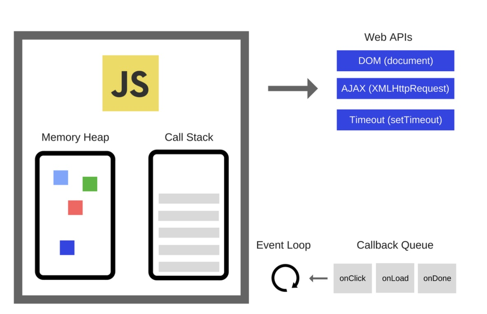

## Symbol, BigInt 
- Symbol : 변경이 불가한 데이터, 유일한 식별자를 만들어 데이터 보호하는 용도로 사용 가능
```jsx
// Symbol()
const sKey = Symbol('Hello')
const user = {
  key: '일반 정보',
  [sKey]:'민감 정보' 
}

console.log(user.key) // 일반 정보
console.log(user['key']) // 일반 정보
console.log(user[sKey]) // 민감 정보
console.log(user[Symbol('Hello!')]) // undefined 
console.log(sKey) // Symbol(Hello)

// Symbol 로 만든 데이터는 Object.key 를 사용해도 볼 수 없다(= 코드상 조회 불가)
// 직접 가져와서 조회를 해야 조회 가능
```
- BigInt: 길이 제한이 없는 정수( number 데이터의 안정적 표현 최대치 2^53-1 보다 더 큰 정수 표현시 사용)  
💡 정수 뒤에 n 붙이거나 BigInt() 호출하여 생성
```jsx
console.log(12342353422624562345436737455234)

console.log(12342353422624562345436737455234n)
console.log(BigInt('12342353422624562345436737455234'))

const a = 11n
const b = 33

// 숫자 => BigInt
console.log(a + BigInt(b)) // 44n
console.log(typeof(a + BigInt(b))) // Bigint

// Bigint => 숫자
console.log(Number(a) + b) // 44
console.log(typeof(Number(a) + b)) // Nunber
```

## 불변성과 가변성
- 불변성(Immutability) : 생성된 데이터가 메모리에서 변경되지 않음(JS 원시형)
- 가변성(Mutability) : 생성된 데이터가 메모리에서 변경될 수 있음(🚨JS 참조형- Object, array, function)
```jsx
// Case 1
let a = { x: 1}
let b = a

b.x = 2

console.log(b)
// a를 수정하지 않았지만 a,b 둘다 x 속성에 2 할당
// x 속성에 대한 value 값이 저장된 메모리 주소가 변경
console.log(a)


// Case 2
let a = { x: 1}
let b = { x : 1}

b.x = 2
// 새로운 메모리 주소에 할당되었기에 값이 변화 X
console.log(b) // {x: 2}
console.log(a) // {x: 1}

// 🚨일치연산자 = 메모리 주소가 같은지를 확인!
console.log({} === {}) // false
```
## 얕은복사와 깊은복사
```jsx
// ex. b 값을 수정할때, a의 값을 변경시키지 않으려면?
const a = {x : 1}
const b = a

b.x = 2

console.log(b) // {x : 2}
console.log(a) // {x : 2}
```

- 얕은 복사(shallow Copy) : 참조형의 1차원 데이터만 복사
```jsx
// Case 1
const a = {x : 1}
// 대상객체 ,출처객체 인수로 전달 -> 새로운 객체를 생성 (얕은 복사)
const b = Object.assign({}, a)

b.x = 2

console.log(b) // {x : 2}
console.log(a) // {x : 1}

// Case 2
const a = {x : 1}
// 전개 연산자 사용 -> 중괄호 제거하고 속성만 복사
const b = {... a}

b.x = 2

console.log(b) // {x : 2}
console.log(a) // {x : 1}
```

- 깊은 복사(Deep Copy) : 참조형의 모든 차원 데이터를 복사
```jsx
const a = {x : {y: 1}}
const b = {...a} // 얕은 복사

b.x.y = 2


// 둘다 y:2 -> 참조형 안에 참조형 같은 경우 얕은복사를 하면 제대로 복사 불가
console.log(b)
console.log(a) 
```

   - 고럼 어떻게 해결할까? ➡ 깊은 복사를 통해 다차원 데이터를 복사  
   💡 lodash 패키지를 이용해보자
   ```jsx
    import { cloneDeep } from "lodash"

    const a = {x : {y : 1}}
    const b = cloneDeep(a)

    b.x.y = 2

    console.log(b)
    console.log(a) // y:1 그대로 유지
   ```

- 배열 데이터 이용한 예시
```jsx
//Example
const a = [1, 2, 3]
const b = a

b[0] = 4

console.log(b) //(3) [4, 2, 3] 
console.log(a) //(3) [4, 2, 3]
```

```jsx
// 얕은 복사
const a = [1, 2, 3]

// 1. concat - 대상과 인수로 들어오는 배열을 병합하여 새 배열 반환
const b = a.concat([])
// 2. 전개연산자 사용
const b =[... a]

b[0] = 4

console.log(b) //(3) [4, 2, 3] 
console.log(a) //(3) [1, 2, 3]
```

```jsx
// 깊은 복사
import { cloneDeep } from "lodash"

const a = [[1, 2], [3]]
const b = cloneDeep(a)

b[0][0] = 4

console.log(b) // [[4, 2], [3]] 
console.log(a) // [[1, 2], [3]]
```

## 가비지 컬렉션(GC)
- JS의 메모리 관리 방법, JS 엔진이 자동으로 데이터가 할당된 메모리에서 더 이상 사용되지 않는 데이터를 해제 하는 것  
🚨 개발자가 직접 강제 실행 및 관리 불가

## 클로저
- 함수가 선언될때 유효(렉시컬)범위를 기억하고 있다가, 함수가 외부에서 호출시 그 유효범위의 특정 변수를 참조할 수 있는 것
```jsx
function createCount() {
  let a = 0
  return function() {
    return a += 1
  }
}

// a 라는 변수는 count 변수에서 생성된 것이 아님
// a가 함수 블럭 범위에서 유효하기에 클로저 개념이 적용되어 1, 2, 3 이 출력되는 것
const count = createCount()

console.log(count()) // 1
console.log(count()) // 2
console.log(count()) // 3

// count2 에서 a 변수 재사용
const count2 = createCount()
console.log(count2) // 1
console.log(count2) // 2
```


- Case
```jsx

const h1El = document.querySelector('h1')
const h2El = document.querySelector('h2')

// 🚨 별도의 상태관리 필요
let h1IsRed = false
let h2IsRed = false

h1El.addEventListener('click', event => {
  h1IsRed = !h1IsRed
  h1El.style.color = h1IsRed ? 'red' : 'black'
})

h2El.addEventListener('click', event => {
  h2IsRed = !h2IsRed
  h2El.style.color = h2IsRed ? 'red' : 'black'
})
```

```jsx
const h1El = document.querySelector('h1')
const h2El = document.querySelector('h2')

const createToggleHandler = () => {
  let isRed = false
  return event => {
    isRed = !isRed
    event.target.style.color = isRed ? 'red' : 'black'
  }
}

h1El.addEventListener('click',createToggleHandler())

// 💡 h2 에서 함수가 반환하는 클로저(isRed)를 이용 - > 하나의 함수로 2개 요소의 상태를 관리
h2El.addEventListener('click',createToggleHandler())
```

## 메모리 누수
- 더 이상 필요하지 않은 데이터가 해제되지 못하고 메모리를 계속 차지하는 현상
🚨 불필요한 전역변수 사용  
```jsx
// 전역객체를 사용하면 가비지 컬렉션이 순회하더라도 사용중이라고 판단하여 메모리 누수 발생
window.hello = 'Hello Worold'
window.heropy  = { name :'Heropy'}
```
🚨 분리된 노드 참조  
```jsx
const btn = document.querySelector('button')
// 요소가 가진 메모리 주소는 여전히 유효
const parent = document.querySelector('.parent')

btn.addEventListener('click', () => {
  // remove 버튼 눌러도 제거된 parent 계속 출력 -> 메모리 누수
  console.log(parent)
  parent.remove()
})

// 어떻게 수정?
btn.addEventListener('click', () => {
  // 버튼 클릭시에만 찾도록 변경
  const parent = document.querySelector('.parent')
  console.log(parent)
  // and 연산자를 이용하여 참일때 remove 실행, 거짓일때는 remove 실행 X 
  parent && parent.remove()
})
```
🚨 해제하지 않은 타이머  
```jsx
let a = 0
setInterval(() => {
  a += 1
}, 100)

setTimeout(() => {
  console.log(a)
}, 1000)

// 어떻게 수정?
let a = 0
const interVaild = setInterval(() => {
  a += 1
}, 100)

setTimeout(() => {
  console.log(a)
  // 타이머 해제
  clearInterval(interVaild)
}, 1000)
```
🚨 잘못된 클로저 사용  
```jsx
const getFn = () => {
  let a = 0
  return name => {
    a += 1
    console.log(a)
    return `Hello ${name}~`
  }
}
// a 변수가 계속 누적 -> 호출시마다 값 1씩 증가
const fn = getFn()
// 필요한 코드는 이름만 출력하는 로직만 필요
// 클로저 개념은 불필요 -> 메모리 누수
console.log(fn('Wangi'))
console.log(fn('lee'))
console.log(fn('kim'))
```

## 콜 스택, 태스크 큐, 이벤트 루프


### 이미지 출처 :https://jongbeom-dev.tistory.com/119

💡 Call stack(Last In First Out)  
💡 Task Queue(First In First Out)

```jsx
// 2 먼저 출력---> 왜?

// setTimeOut 기능은 call stack에서 바로 호출이 불가, webapi 필요 
// ➡ call stack -> web Api -> task Queue
// 🚨 event loop 는 call stack이 비어야 taskQueue의 쌓인 동작을 실행
// 따라서 console.log(2) 가 먼저 실행되며 call stack 이 비게 되고
// 그제서야 Task Queue 에 있던 setTimeOut을 Evnet Loop가 실행함
setTimeout(() => {
  console.log(1)
}, 0)

// console.log -> 바로 실행가능, stack 에 쌓이지 않고 바로 실행
console.log(2) 
```