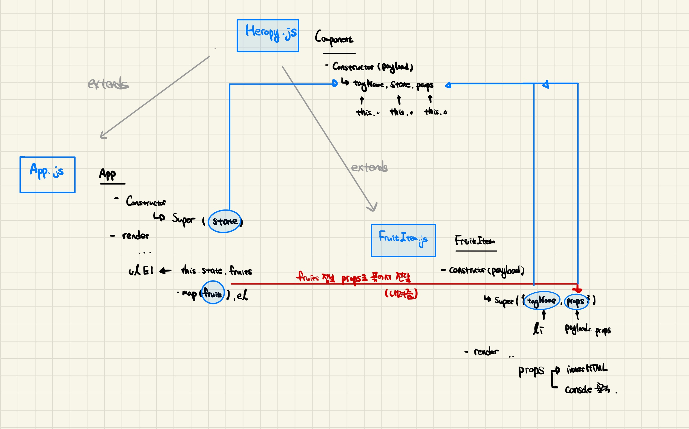

## 컴포넌트
### 재사용 가능한 각각의 독립된 기능의 모듈, 화면에 보여지는 각각의 UI 단위

- 컴포넌트 생성 클래스 작성
```jsx
// heropy.js
export class Component {
  constructor(payload = {}) {
    const { tagName = 'div' } = payload
    this.el = document.createElement(tagName)
    this.render()
  }
  render() {
    // ....?
  }
```
```jsx
// app.js
// heropy.js로 부터 Component 가져와서 상속 -> render 함수 새로 정의 (React, Vue 의 기본원리)
export default class App extends Component {
  constructor() {
    super({
      tagName : 'h1' // Component 클래스 내용따라서 h1태그로 생성
    }) 
  }
  render() {
    this.el.textContent = 'Hello World!'
  }
}
```


- 선언적 렌더링 및 이벤트 핸들링
```jsx
import { Component } from "./core/heropy";


// heropy.js로 부터 Component 가져와서 상속 -> render 함수 새로 정의 (React, Vue 의 기본원리)
export default class App extends Component {
  render() {
    this.el.classList.add('search')
    this.el.innerHTML = /* HTML */`
    <input />
    <button>Click!</button>
    `
    // document 라는 문서 전체에서 찾는 것이 아닌 this 객체 안에서  찾는다 -> 효율성!
    this.el.querySelector('input')
  }
}
```


- 조건 과 반복
```jsx
export default class App extends Component {
  constructor() {
    super({
      state: {
        fruits : [
          { name : 'Apple', price : 1000 },
          { name : 'Banana', price : 2000 },
          { name : 'Cherry', price : 3000 }

        ]
      }
    })
  }
  render() {
    console.log(this.state.fruits)

    this.el.innerHTML = /* html */ `
      <h1>Fruits</h1>
      <ul>
        ${this.state.fruits
        // filter 메소드 이용해서 조건부여
          .filter(fruit => fruit.price < 3000)
        // map 메소드 이용하요 조건을 통과했을때 Li tag 반복하여 생성
          .map(fruit => `<li>${fruit.name}</li>`)
          .join('')
          }
      </ul>
    `
  }
```

- 자식 컴포넌트에게 데이터 전달
```jsx
  render() {
    console.log(this.state.fruits)

    this.el.innerHTML = /* html */ `
      <h1>Fruits</h1>
      <ul></ul>
    `
    const ulEl = this.el.querySelector('ul')
    ulEl.append(...this.state.fruits
          .filter(fruit => fruit.price < 3000)
          .map(fruit => new FruitItem({
            // map 메소드를 통해 반복되는 과일 정보를 객체 데이터를 props로 묶어서 FruitItem 으로 전달
            props : {
              name: fruit.name,
              price: fruit.price
            }
          }).el)
    )
  }
```

### Class 에서 미흡한 개념

- Super : 부모 클래스에게 상속받아 자식 클래스를 생성, 이때 자식 클래스에 속성을 추가할때 필요한 것이 super
   - 출처 : https://developer.mozilla.org/ko/docs/Web/JavaScript/Reference/Operators/super


- 자식 클래스의 constructor 내부에 작성, 부모 클래스의 속성값을 불러와 초기화


### 그림으로 그려보는 App.js, Heropy.js, FruitItem.js



