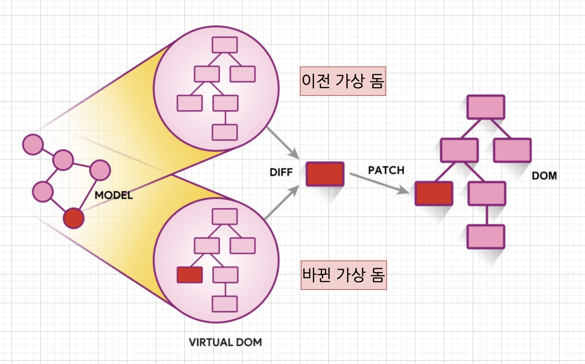

## What is React?
사용자 인터페이스를 만들기 위한 Javascript 라이브러리

### 라이브러리 vs 프레임워크
- 프레임워크 : 어떠한 앱을 만들기 위해 필요한 대부분의 것을 갖고 있음
- 라이브러리 : 특정 기능을 모듈화 해놓은 것

`리액트는 라이브러리!` => UI 렌더링하는데 관여
- Routing : react-router-dom
- Status Managing : Redux,Recoil, mobx..
- Build : webpack, npma
- Test : Eslint, Mocha

- 각각 필요한 기능이 있다면 다른 라이브러리를 가져와서 사용해야 함.


## React Component
`리액트로 만들어진 앱을 이루는 최소한의 단위`  
- 컴포넌트 조각의 합 = 리액트

### 함수형 컴포넌트 vs 클래스형 컴포넌트
```js
// 1. 함수형
function App(){
  return <h1>안녕</h1>
}

// 2. 클래스형
class App extends Component{
  render(){
    return <h1>안녕</h1>
  }
}
```
- 리액트 Hooks 발표이후 함수형 컴포넌트를 더 많이 이용


## Virtual DOM

### DOM
`웹 페이지의 구성 요소를 JS가 이용가능하게 끔 브라우저가 트리 구조로 만든 객체 모델 `

- DOM API를 이용하여 DOM 조작 가능
```js
// button 요소를 클릭시 배경을 파란색으로 변경
document.queryselector('.button');
button.onclick = function(){
  // DOM 안의 요소의 스타일을 직접 변경(DOM 조작)
  this.style.backgroundColor = "blue";
}
```

### CRP(Critical Rendering Path) : 웹 페이지 빌드과정
1. 렌더엔진, 문서 읽고 파싱, 렌더링 내용결정 -> DOM Tree 생성
2. DOM와 CSSOM 결합 -> Render Tree 생성
3. 브라우저, 각 요소의 크기 및 위치 계산 -> LayOut(reflow)
4. 실제 화면에 그리기 -> Paint

`문제는 DOM 에 변화가 생겼을 때 Render Tree , LayOut, Paint 과정을 재실시`

=> 만약 인터렉션이 많은 앱이라면 불필요한 DOM 조작이 많아짐
- 리액트는 이를 가상 DOM 을 활용하여 해결

### Virtual DOM
실제 DOM 과 비슷하나 직접적으로 브라우저에 접근하여 요소 직접 수정 불가


1. State 변경 -> 새로운 가상돔 생성
2. Diffing -> 이전 가상돔과 바뀐 가상 돔 비교 및 변경부분 탐색
3. Reconciliation -> 바뀐 부분만 실제 돔에 적용(batch Update 수행)

`결국 위 과정을 통해 10가지의 State 가 바뀌어도 한번의 DOM 조작으로 모든 변화를 반영`
